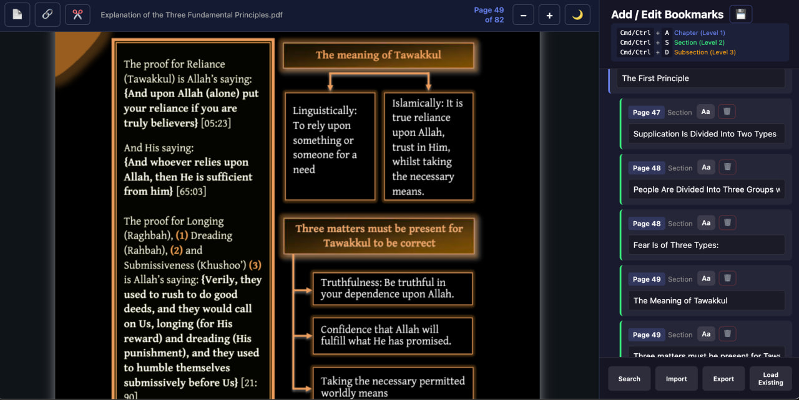
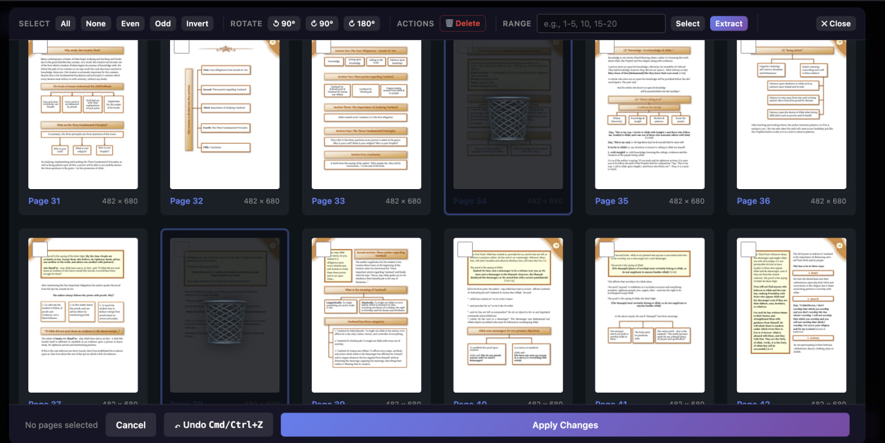

 PDF Bookmark Editor (chrome, firefox, edge)

 https://mrfragger.github.io/pdf-bookmark-editor/

- Add / Edit bookmarks for a PDF
- add chapter, section or subsection bookmarks
- select text in pdf to use for bookmark title
- load existing bookmarks
- import or export bookmarks to a text file
- Titlelize chapter titles Aa (see example)
- Chapter 2: Parts Of Speech ---> Chapter 2: Parts of Speech
- merge PDFS retaining existing bookmarks
- rearrange order of PDFs to merge
- rotate, delete pages
- select all, none, even, odd, invert
- select ranges 22-34, 38, 42, 44-56
- visually drag thumbnails to reorder
- undo
- minisearch multi term search, bm25
- ranking score search results
- since most PDF viewers only allow searching on one term
- PWA (progressive web app), installs offline
- Librewolf/Firefox bookmark and it'll be cached




 There should be a free PDF editor for bookmarks without ads, freemium or a subscription.  I looked but never could find one.  Just a few python command line ones that work great for advanced users. This app is all local.  No cdn (content delivery networks) either just 5 files loaded ~3MB total.
 ```
index.html 91KB
pdf.worker.min.js 1.1MB
pdf-lib.min.js 525KB
pdf.min.js 320KB
index.min.js 19KB
```
Doesn't do vertical position within PDFs (pretty much requires python pymupdf) but allows one to easily modify bookmarks for pages. Can't put compression since that pretty much requires ghostscript (gs) and crop.  Those are the two functions I'd like to implement but it's not practical for this small little app. For annotation, adding text, highlightning open PDF in firefox.

### Use Ghostscript (free AGPL) for PDF compression:
```bash
brew install gs         sudo apt install gs      choco install gs

# Good balance of size and quality (150 dpi)
gs -sDEVICE=pdfwrite -dPDFSETTINGS=/ebook -dNOPAUSE -dBATCH -sOutputFile=compressed.pdf input.pdf

# Smallest size (72 dpi, lower quality)
gs -sDEVICE=pdfwrite -dPDFSETTINGS=/screen -dNOPAUSE -dBATCH -sOutputFile=compressed.pdf input.pdf

# High quality (300 dpi)
gs -sDEVICE=pdfwrite -dPDFSETTINGS=/printer -dNOPAUSE -dBATCH -sOutputFile=compressed.pdf input.pdf
```


